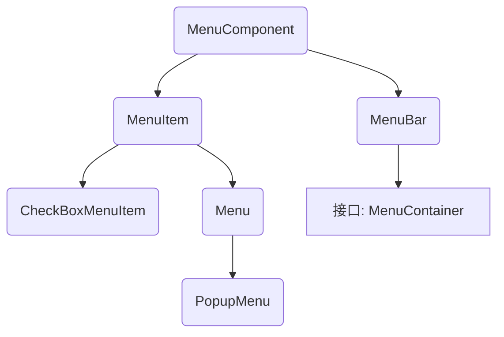

# 菜单组件

| 菜单组件名称     | 功能                                                         |
| ---------------- | ------------------------------------------------------------ |
| MenuBar          | 菜单条 ， 菜单的容器。                                       |
| Menu             | 菜单组件 ， 菜单项的容器。 它也是Menultem的子类 ，所以可作为菜单项使用 |
| PopupMenu        | 上下文菜单组件(右键菜单组件)                                 |
| Menultem         | 菜单项组件                                                   |
| CheckboxMenuItem | 复选框菜单项组件                                             |




Menu 存放 MenuItem，但因为菜单也可以作为菜单项，如上文中的格式是一个菜单，也是编辑菜单中的菜单项。所以 Menu 是 MenuItem 的子类。

## 开发逻辑

1. 准备好菜单项组件
2. 准备菜单组件 Menu 或 PopupMenu（右键弹出子菜单），添加菜单项组件
3. 准备菜单条组件，把菜单组件添加进来（frame.addMenuBar(mb);）
4. 把菜单条组件添加到窗口中

## 小技巧

菜单项之间的分割线：`Menu.add(new MenuItem("-"))`。

给某个菜单项关联快捷键功能：`new MenuItem("菜单项名字",new MenuShortcut(KeyEvent.VK_Q,true))`KeyEvent.VK_Q表示 Ctrl + Q，后面加 true 就是 Ctrl+Shift+Q。

## PopupMenu

右键出现菜单。

```java
public class PopupMenuTry {
    TextArea ta=new TextArea(6,40);
    Frame f=new Frame();
    PopupMenu pm=new PopupMenu();
    MenuItem mi1=new MenuItem("注释");
    MenuItem mi2=new MenuItem("取消注释");
    MenuItem mi3=new MenuItem("复制");
    MenuItem mi4=new MenuItem("保存");
    public void init(){
        pm.add(mi1);
        pm.add(mi2);
        pm.add(mi3);
        pm.add(mi4);
        ta.add(pm);//PopupMenu 添加到要右键的组件中
        f.add(ta);
        f.pack();
        f.setVisible(true);
        ta.addMouseListener(new MouseAdapter() {
            @Override
            public void mouseReleased(MouseEvent e) {
                if(e.isPopupTrigger()){//如果为 true，证明是右键；否则是左键
                    pm.show(ta,e.getX(),e.getY());//三个参数分别是父组件、菜单出现的横纵坐标，用 getXY() 获取当前位置
                }
            }
        });
    }
    public static void main(String[] args) {
        new PopupMenuTry().init();
    }
}
```

# 绘图

其实之前学习的各种组件，展现效果不同，都是用 awt 的绘图功能绘制的。

Graphics 对象进行绘图，在Component类中，又提供了下列三个方法来完成组件图形的绘制与刷新：

​	paint(Graphics g):绘制组件的外观；

​	update(Graphics g):内部调用paint方法，刷新组件外观；

​	repaint():调用update方法，刷新组件外观；


paint() 方法系统自动调用，程序员只需要调用 repaint() 完成。

如果想重写按钮的默认样式，绘制属于自己的图像，需要重写 paint() 中的方法。

## Graphics

画画需要画布、画笔、以及不同颜色的颜料。

Canvas 类是画布，Graphics 是画笔，其中的 setColor() 方法设置颜色。

### 画图步骤

1. 自定义类继承 Graphics 类，重写 paint() 方法；

2. 在 paint() 方法内部，开始绘制之前先设置好颜色、字体等属性，setColor() setFont()。

3. 调用 drawXxx() 方法开始绘画。

   

   | 方法名称           | 方法功能               |
   | ------------------ | ---------------------- |
   | setColor(Color c)  | 设置颜色               |
   | setFont(Font font) | 设置字体               |
   | drawLine()         | 绘制直线               |
   | drawRect()         | 绘制矩形               |
   | drawRoundRect()    | 绘制圆角矩形           |
   | drawOval()         | 绘制椭圆形             |
   | drawPolygon()      | 绘制多边形             |
   | drawArc()          | 绘制圆弧               |
   | drawPolyline()     | 绘制折线               |
   | fillRect()         | 填充矩形区域           |
   | fillRoundRect()    | 填充圆角矩形区域       |
   | fillOval()         | 填充椭圆区域           |
   | fillPolygon()      | 填充多边形区域         |
   | fillArc()          | 填充圆弧对应的扇形区域 |
   | drawImage()        | 绘制位图               |

```java
public class GraphicsTry {
    private final String OVAL_SHAPE="oval";
    private final String RECT_SHAPE="rect";
    private String SHAPE="";
    private Frame f=new Frame();
    private Button btOval=new Button("绘制椭圆");
    private Button btRect=new Button("绘制矩形");
    private Panel p=new Panel();
    private MyCanvas mc=new MyCanvas();//列出组件，全部是 private 的。 MyCanvas 是继承 Canvas 的类，可以重写 paint() 方法。

    public void init(){
        //按钮点击绑定事件
        btOval.addMouseListener(new MouseAdapter() {
            @Override
            public void mouseReleased(MouseEvent e) {
                SHAPE=OVAL_SHAPE;//以此判断要绘制的图形是椭圆还是矩形
                mc.repaint();
            }
        });
        btRect.addMouseListener(new MouseAdapter() {
            @Override
            public void mouseReleased(MouseEvent e) {
                SHAPE=RECT_SHAPE;
                mc.repaint();
            }
        });
        mc.setPreferredSize(new Dimension(300,200));//设置画布大小
        //组装组件
        p.add(btOval);
        p.add(btRect,BorderLayout.EAST);
        f.add(mc,BorderLayout.NORTH);
        f.add(p);
        f.pack();
        f.setVisible(true);
    }
    
    public static void main(String[] args) {
        new GraphicsTry().init();//调用 init() 方法
    }

    public class MyCanvas extends Canvas{//重写绘制椭圆和矩形的 paint() 方法
        @Override
        public void paint(Graphics g){
            if(SHAPE.equals("oval")){
                g.setColor(Color.RED);
                g.drawOval(100,100,20,10);
            }
            else if(SHAPE.equals("rect")){
                g.setColor(Color.RED);
                g.drawRect(100,100,20,10);
            }
        }
    }
}
```

