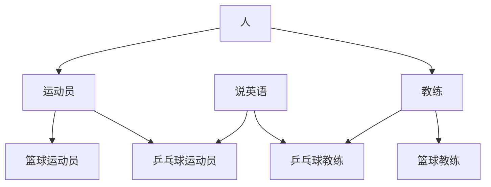

以黑马程序员全套Java教程网课为主。


抽象方法：没有方法体的方法

```java
public abstract void eat();
```

抽象类：含有抽象方法的类。

（没有抽象方法的类也可以是抽象类，但是意义何在）

抽象类不能直接创建对象，需要子类把抽象方法重写补全后才能创建对象。否则，子类也是抽象方法。

# 接口

接口是一种公共的行为规范标准，只要符合规范，大家都可以使用。 java 中的接口主要是对行为的抽象。如：

```java
public interface Jumpping{//接口
    public abstract void Jump();
}

public class Cat implements Jumpping{//实现
    //重写 Jump() 方法。如果不重写， Cat 就是一个抽象类
}
```

接口中的成员变量默认是 public static final 的，不能修改，而且可以通过 Class.成员变量 的方式直接访问。

接口中没有构造方法和非抽象方法。成员方法默认是 public abstract 的。

（但接口的实现类中可以有 super。这是因为所有没有父类的类都默认继承自 Object 类，如果接口的实现类使用 Object 类中的方法就会用到 super）

接口是抽象类，不能直接实例化，可以借助多态的方法实例化。

相较类与类之间不能多继承，只能层层继承：接口可以多实现`implements interface1, interface2`

接口和接口之间也可以多继承`interface1 extends interface2, interface3`

## 总结


## 设计原则

抽象类中的抽象方法所有对象中都必须有；接口则是选择性实现的。比如门这一大类，其中不管什么门，防盗门、木门、自动门，都有门的特有行为（开关门、锁门……）只是实现方法可能不一样，所以要在门父类中定义这些抽象方法，在子类中必须实现。

但是对于门来说不是必须有的抽象方法（如响铃）这种抽象方法就应该作为接口，选择性实现。有响铃功能的门实现这一接口，没有响铃功能的门不必实现。

例：有乒乓球运动员、乒乓球教练、篮球运动员、篮球教练。为了能出国交流，乒乓球运动员和教练需要会说英语。分析本例如何用具体类、抽象类、接口实现。



其中，人、运动员、教练是抽象类，说英语是接口。其他具体类需要实现接口，并重写继承的所有抽象方法。

## 抽象类 / 接口作为形参 / 返回值

类也可以作为形式参数或函数的返回值。

抽象类：如果方法的形参或函数的返回值是抽象类名，实际需要的是实现了该抽象类的子类对象。

如函数形参是Animal，实际需要通过多态的方法Animal a=new Cat();然后把a传给函数。

接口作为形参/函数返回值，和抽象类一样，实际需要的是实现了该接口的类对象。

