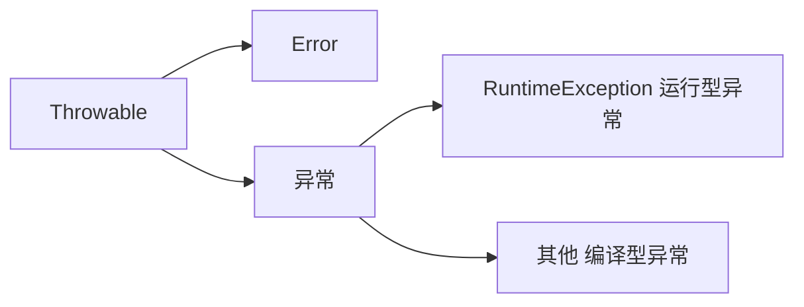

有时因为编译错误，会提示一些信息（如：数组越界 ArrayIndexOutOfBoundException) 其实这些提示信息也是类。

# Throwable

Throwable 是所有错误、异常的父类。



Error 程序无法处理，而异常程序可以处理。

RuntimeException：运行时异常，非受检异常， 可以先不处理，真的异常了再进行处理。在编译期间不会检查，其他类错误在编译期间检查。

编译时异常：受检异常，不管运行会不会异常，都需要进行异常处理，不然无法编译。

# 处理异常

JVM 对异常的默认处理方式：输出异常名称、位置、原因，并停止运行。

程序员还可以有自己的处理异常方法，如 try...catch 和 throw。

## try...catch

```java
try{
    可能出现异常的代码;
}
catch(异常类名 变量名){
    出现异常后的处理代码;
}

String s="2022-05-07";
SimpleDateFormat sdf=new SimpleDateFormat("yyyy-mm-dd");
sdf.parse(s);//这个方法不能直接用，必须要加异常处理

try{
    sdf.parse(s);
}
catch(ParseException e){
    System.out.print("parseException!");//不管会不会发生异常，都要写
}
```

出现异常时，异常对象会被提交给 Java 运行时系统，如果和 catch 中的异常类匹配就会进行异常的处理，**处理完成后可以继续执行。**

如果异常变量命名为 e ,尝试调用 e 的成员方法`e.printStackTrace()`就会输出平时出现异常时系统默认提示的信息：`java.lang.ArrayIndexOutOfBoundsException: Index 3 out of bounds for length 3  at com.ithema_02.ExceptionDemo02.method..... `

但是通过这种方法处理异常之后，异常后面的部分仍然可以执行。

### Throwable 的成员方法

Throwable 作为超类，其所有子类都可以使用他的成员方法。

| 方法                          | 说明                              |
| ----------------------------- | --------------------------------- |
| public String getMessage()    | 返回此 Throwable 的详细消息字符串 |
| public String toString()      | 返回此可抛出的简短描述            |
| public void printStackTrace() | 把异常的错误信息输出到控制台      |

```
e.getMessage():  Index 3 out of bounds for length 3
e.toString(): java . lang.ArrayIndexOutOfBoundsException: Index 3 out of bounds for length 3
e.printStackTrace(): java.lang.ArrayIndexOutOfBoundsException: Index 3 out of bounds for length 3  at com.ithema_02.ExceptionDemo02.method.....
```

利用 Ctrl B 追根溯源可以得知， getMessage() 内部大概是这样的：

```java
public class Throwable {
    private String detailMessage;//Throwable 类中的一个成员方法
    
    public Throwable(String message){
        detailMessage=message;//构造方法。出现异常时，会通过这种方法构造一个异常对象
    }
    
    public String getMessage(){
        return detailMessage;
    }
}
```

## Throws

可以抛出异常给 try catch 处理，但是自身不能解决。

```java
throws 异常类名;

public static void main(String[] args){
    System.out.println("运行开始");
    method1();
    try{
        method2();//抛出给了 try catch 处理
    }
    catch(ParseException e)
    {
        System.out.println("运行错误");
    }
    System.out.println("运行结束");
}

public static void method1() throws ArrayIndexOutOfException{
    int[] arr={1,2,3};
    System.out.println(arr[3]);//会报错并停止运行， throws 并没有解决异常
}

public static void method2() throws ParseException{
    String s="2022-05-07";
	SimpleDateFormat sdf=new SimpleDateFormat("yyyy-mm-dd");
	sdf.parse(s);//因为抛出，可以使用了。如果异常，try catch 会显示“运行结束”并继续运行。
}
```

# 自定义异常

```java
public class 类名 extends Exception{
    无参构造
    带参构造
}

public class ScoreException extends Exception{
    public ScoreException(){}
    public ScoreException(message){
        super(message);//把 message 传给父类处理
    }
}

//异常类的使用
public class Teacher throws ScoreException{
    public void checkScore(int score)
    {
        if(score<0||score>100){
            throw new ScoreException("输入分数有误！请重新输入");//throw 不是 throws!
            /*throw 写在方法体内，throws 写在类定义里。
            throws 不一定有异常，而 throw 一定是抛出了异常。*/
        }
        else
            System.out.println("分数正常");
    }
}

public static void main(String[] args){
    Scanner sc=new Scanner(System.in);
    int score=sc.nextInt();
    Teacher t=new Teacher();
    try{//调用方法时，要处理抛过来的异常
        t.checkScore(score);
    }
    catch(ScoreException e){
        e.printStackTrace();
    }
}
//异常时就会输出：异常类型 ScoreException，异常原因"输入分数有误！请重新输入"，异常位置。
```

