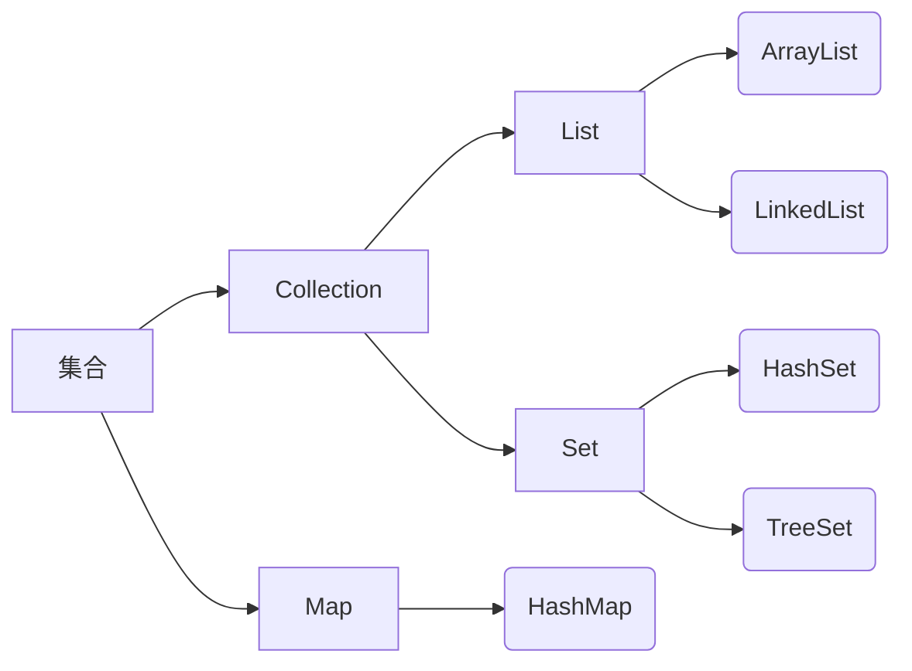
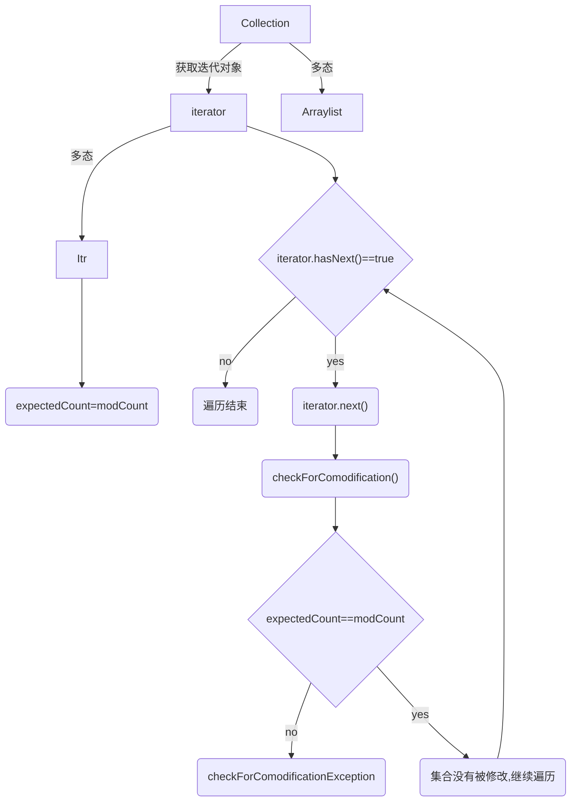

其中方形的是接口，圆角的是实现类。

因此先学习 Collection 和 Map 接口后，只需要学习下一级的特有的部分。

# Collection

java.util.Collection

Collection 是单例集合的最高级接口。他表示一组对象，这些对象也被称为 Collection 的元素。

无法直接实现。可以用多态的方式实现。

```java
Collection<String> c=new ArrayList<String>();
//add(E e) 方法添加元素
c.add("Hello");
c.add("World");
System.out.println(c);//输出['Hello','World']，因为 ArrayList 中重写了 toString 方法，所以得到的不是一串地址
```

| 方法                       | 说明                                      |
| -------------------------- | ----------------------------------------- |
| boolean add(E e)           | 添加元素，永远返回 true                   |
| boolean remove(Object o)   | 从集合中移除指定的元素，成功移除返回 true |
| void clear()               | 清空集合中的元素                          |
| boolean contains(Object o) | 判断集合中是否存在指定的元素              |
| boolean isEmpty()          | 判断集合是否为空                          |
| int size()                 | 集合长度                                  |

快捷键：Alt+7，能看到类的所有信息

## 迭代器 iterator

java.util.Iterator

Iterator 是一个接口。使用 Iterator 迭代器遍历集合元素。

```java
Iterator<String> it=c.iterator();//通过集合对象中的迭代方法获取对象
```

追根溯源可以得知，Collection.iterator()方法返回的是一个实现了 Iterator 接口的类：Itr.

所以实际上是通过多态的方式实例化的。

| 方法              | 说明                                                         |
| ----------------- | ------------------------------------------------------------ |
| E next()          | 返回下一个元素（越界访问：NoSuchElementException，被请求的元素不存在） |
| boolean hasNext() | 如果存在下一个元素，返回 true                                |

```java
while(it.hasNext()){
    String s=it.next();//这样更好一些，因为元素可能还要做其他操作
    System.out.println(s);
}
```

it.next() 像指针一样从0开始遍历。

# List

java.util.List

继承自 Collection 类，可以使用其中的方法。

List 是有序、有索引的。相较于集合 Set，List 中的元素可以重复。

```java
List<String> l=new ArrayList<String>();
l.add("Hello");
l.add("World");
System.out.println(l);//按存储的顺序输出，["Hello","World"]
```

| 方法                          | 说明           |
| ----------------------------- | -------------- |
| void add(int index,E element) | 感觉并不用解释 |
| E remove(int index)           |                |
| E set(int index,E element)    |                |
| E get(int index)              |                |

越界报错 IndexOutOfException。

另一种遍历集合的方法是 for 循环。

```java
for(int i=0;i<l.size();i++)System.out.println(l.get(i));
```

## 并发修改异常

当不允许这样的修改时，会抛出此方法。

如：在使用 iterator 遍历过程中，在集合中添加了新的元素。

iterator 调用 next() 方法时，会先调用 checkForComodification() 方法。

checkForComodification() 会检验 modCount 修改集合的次数和expectedModCount 预期修改集合的次数是否相等。

modCount 来自于 ArrayList 的父类：AbstractList，初始值为0.每次使用 add() 方法时，modCount 就会++。

expectedCount 来自于 Itr 类，且初始值为 `expectedCount=modCount`.

每次实例化一个 Iterator 类，都会调用其子类 Itr 类，使得 expectedCount 等于当前的 modCount。

然后遍历过程中每次调用 next() 方法时，都会先检查一下`expectedCount==modCount`，即集合有没有被修改。如果没有修改就可以顺利地返回下一个元素；如果有异常 checkForComodificationException，就会终止运行。



但是通过 for 循环遍历集合，在遍历过程中对集合进行修改，不会报异常。

## ListInterator

通过 List 中的 listInterator() 方法得到。可以从各个方向遍历，迭代期间可以修改列表，还可以获取列表迭代器的当前位置。

| 方法                  | 说明                                                         |
| --------------------- | ------------------------------------------------------------ |
| boolean hasNext()     |                                                              |
| E next()              |                                                              |
| boolean hasPrevious() | 反向遍历用到                                                 |
| E previous()          | 反向遍历用到                                                 |
| void add(E e)         | 添加元素，**注意是通过 listInterator 添加的，不是通过集合添加的！** |
|                       |                                                              |

```java
List<String> l=new ArrayList<String>();
l.add("Hello");
l.add("World");
l.add("java");
ListInterator<String> li=l.listInterator();//实际上是 listItr 类作为 listInterator 类的子类，通过多态实现
while(li.hasNext()){
    System.out.println(l.next());
}

while(li.hasPrevious()){
    System.out.println(l.previous());
}

while(li.hasNext()){
    String s=l.next();
    if(s.equals("World")){
        li.add("!!!");//特别注意，并不是调用了l的 add() 方法，而是 li 的 add() 方法！
    }
    System.out.println(s);
}
```

在 listItr 类中的 add() 方法，添加完元素之后，有一句`expectedModCount=modCount;`重新把实际修改值赋给了预期修改值。因此 next() 方法中判断`expectedModCount==modCount`，即使添加了新元素也仍然是 true. 不会发生并发修改异常。

## 增强 for

```java
for(E e:数组或 Collection 的集合)
{
	//在这里使用变量e，把其当做集合元素来用
}

for(int i:arr){
    System.out.println(i);
}

for(int i:list){
    System.out.println(i);
}
//内部是一个 iterator 迭代器，不可以中途修改数据，会引发并发修改异常。
```

## 几种遍历方式的选择

单纯的遍历：增强 for 最简单。

需要用到索引：普通 for。

迭代器也要会用。

# 数据结构

## 栈

后入先出 FILO。

## 队列

先入先出 FIFO。

## 数组

可以根据索引查找，查找效率高；增删效率低。

## 链表

每个结点存储数据和下一个结点的地址值。最后一个结点地址值为空。

相比数组，增删只需要修改增删处前后结点的地址值，效率更高。

但是查询必须从头开始，效率低。

# List 的子类

ArrayList 底层数据结构是数组，LinkedList 底层数据结构是链表。

用法一模一样，查询效率高就用 ArrayList，增删效率高用 LinkedList。

## LinkList 特有功能

| 方法                      | 说明 |
| ------------------------- | ---- |
| public void addFirst(E e) |      |
| public void addLast(E e)  |      |
| public E getFirst()       |      |
| public E getLast()        |      |
| public void removeFirst() |      |
| public void removeLast()  |      |

