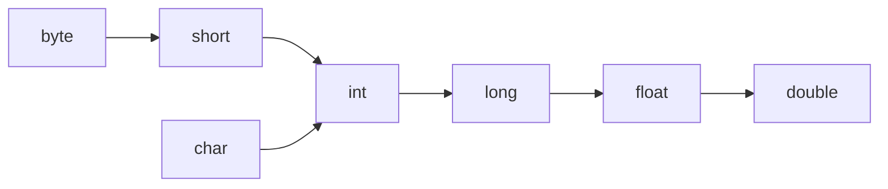

## HelloWorld 案例

学习的时候除了直接用记事本编辑，推荐使用 Notepad++ 。使用 Notepad++ 前需要设置：`设置 -- 首选项 -- 新建 -- 默认语言：Java -- 编码 ANSI`。

新建一个 HelloWorld.java 文件，通过记事本或 Notepad++ 编辑内容：

```java
public class HelloWorld { //这里的 class 类名必须和文件名一致
    public static void main(String[] args) { //main 方法
        System.out.println("Hello World!"); // 单独输出一行的意思。注意大小写不可以出错
    }
}
```

然后在DOS窗口中进入当前文件所在目录，输入命令：

```
javac HelloWorld.java //编译
java HelloWorld //运行
```

这里可见，java 和 C、C++ 一样，属于编译型语言（一次性翻译全部源程序，然后执行机器语言程序），而不是解释型语言（源程序逐条翻译并执行）。

如果顺利运行，就会输出 `Hello World!`。

## Java 基础语法——主要与C语言比较有哪些不同

### 注释

单行注释 `//` 、多行注释 `/* */` 都和C一样。还有一个文件注释 `/** */`暂时用不到，之后了解。

### 关键字

字母全部小写。

###### 数据类型：

整数型：byte, short, int, long

浮点型：float, double

字符型：char

布尔型：boolean

变量的定义和 c 相似，`int a=10;` 不能重复定义和未初始化就使用。

```java
long l=1000000L;
float f=1.235F; //防止 long 类型和 float 类型不兼容
```

标识符命名：数字、字母（区分大小写）、_、$ 组成，数字不能开头。

*命名规范：*

*方法和变量：一个单词时，首字母大写；标识符由多个单词组成时：小驼峰命名法*

*类名：大驼峰命名法*

### 运算符

+，-，*，/，%，

+=，-=，*=，/=，%=（隐含了强制类型转换）

++，--（和 C 不太一样！最好单独写，不要写在表达式中）

==，>=，<=，>，<，!=

? : 

&，|，^，!（逻辑运算符）

&&，||（短路逻辑运算符，如果左边足以判断表达式的结果，右边就不会执行）

与 C 不同的是，Java 里的 + 号可以进行字符串拼接。字符串变量碰到其他类型变量就会拼接。

```java
1+99+"string" //"100string"
"string"+1+99 //"string199"，从左往右计算
```


## 类型转换

自动类型转换：把小范围的变量赋值给大范围的变量

数据范围从小到大：



算术表达式中包含多个基本数据类型的值时，整个算术表达式的类型就会自动提升。

强制类型转换：赋值运算符中隐含。

```java
short s=10;		
s+=10;			//正常
s=s+10;			//错，因为右边发生了自动类型转换，变成了int型
s=(short)(s+10);//也可以
```


